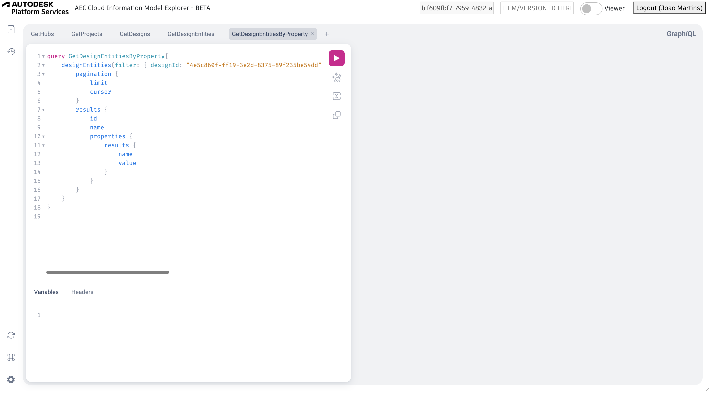
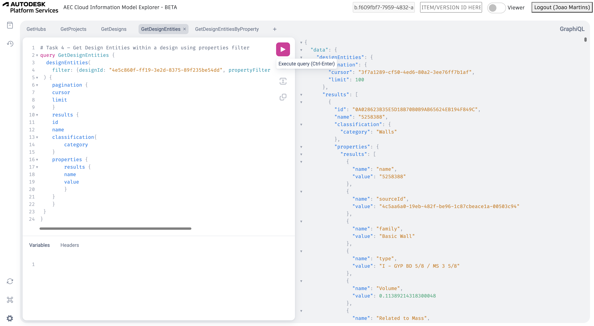
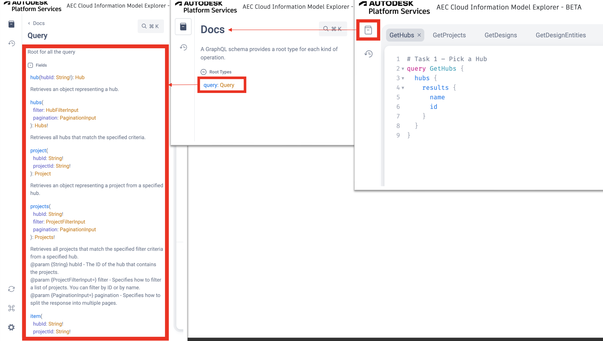
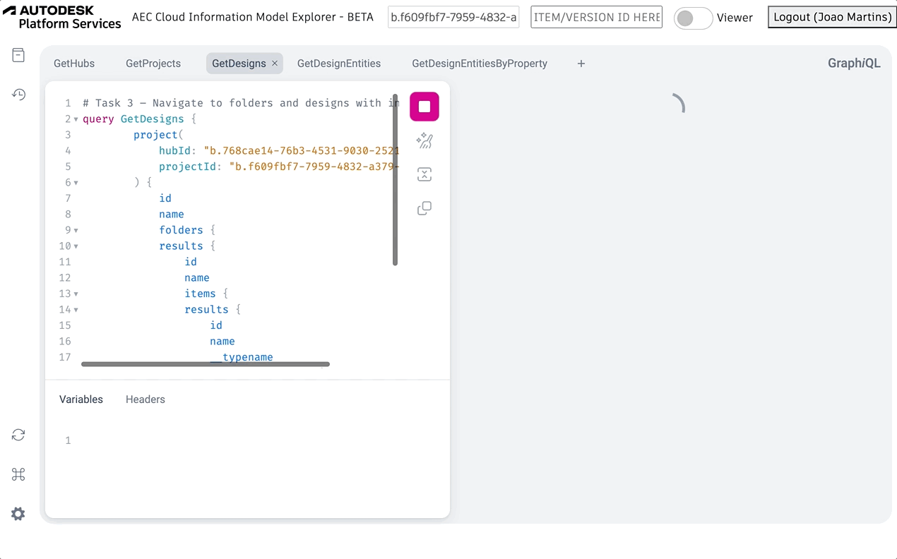
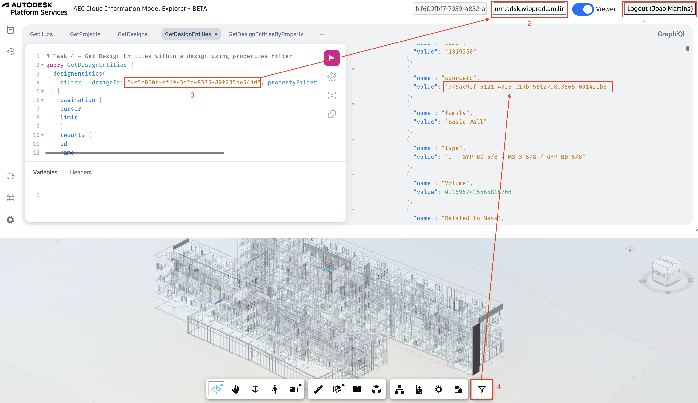

# AEC CIM Explorer

The sample is using this [GraphiQL project](https://github.com/graphql/graphiql) that makes it really easy to discover the AEC CIM Data API.
It also integrates with the Viewer in order contextualize the query results.

## Setting up the app

- clone this repository or download
- restore the packages
- replace the variable values at appsettings.Development.json with your own

```json
{
  "APS_CLIENT_ID": "YOUR CLIENT ID",
  "APS_CLIENT_SECRET": "YOUR CLIENT SECRET",
  "APS_CALLBACK_URL": "http://localhost:8080/api/auth/callback"
}
```
**Make sure your APS app also uses the same callback url!**

## Running the app


As instructed in the console, you'll need to open a web browser and navigate to http://localhost:8080 in order to log into your Autodesk account

## Output

Once you logged in with your Autodesk account in the browser, this should appear:



This sample comes by default with the step-by-step tutorial queries in multiple tabs. You can run the queries available in these tabs and add your own.



You can also check the documentation



Viewer is controlled by the toggle switch in the header. It will load the model based on the item or version Id specified by the input.



---

## Tips & Tricks



1. **You need to be logged in order to use any feature in this sample.**
2. **Item/Version id field accepts id of a version or an item. If you specify an item, it'll automatically load the latest version**
3. **Make sure the designId and Item/Version Id are related to the same model.**
4. **The filter extension looks for source ids in the last query response, then look for externalIds in the loaded model to isolate them.**

## Troubleshooting

1. **Cannot load viewer**: Make sure you're logged in and using a valid Item/Version Id.

2. **Filter Extension doesn't highlight elements**: Make sure you're using the Item/Version Id compatible with the designid used in the queries.

3. **Can't change project id**: ProjectId input is fixed for this beta, since it only works for this project.
